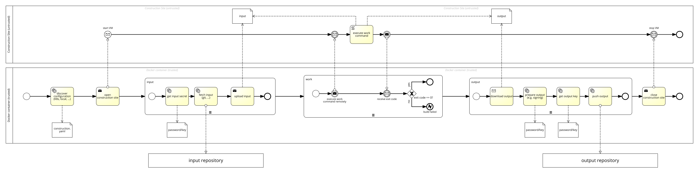

# Constructor

A Docker image that can build software in a secure way, including Docker images.

## Usage

An example input configuration file can be found in this repository:

[./plan-example.yaml](plan-example.yaml)

`constructor` itself can be build with `constructor`:

[./plan-constructor.yaml](plan-constructor.yaml)

And also in every Kubernetes cluster:

[./plan-constructor-kubernetes-job.yaml](plan-constructor-kubernetes-job.yaml) 

## Building

    $ make

After successful build, a Docker image called `constructor` is available. If you need to run the Docker command with
`sudo`, set up the `DOCKER_CMD` variable:

    $ DOCKER_CMD="sudo docker" make

## Process

## Dev Notes

Test the generated image:

    $ qemu-system-x86_64 \
        -kernel constructor/vm/vmlinuz \
        -initrd constructor/vm/initrd \
        -hda constructor/vm/disk \
        -nographic \
        -append "root=/dev/sda console=ttyS0 rw" \
        -m 1024 \
        -net user,hostfwd=tcp::22222-:22 -net nic

Build only `constructor` image and not disk (if already built):

    $ make constructor-image

After building, one is able to do simple Python development by doing these steps:

    $ docker run -it -v $(pwd):/work --entrypoint bash constructor
    # ln -s /work/plan-constructor.yaml /plan.yaml
    # cd work
    # constructor/construct.py    # as often as you want

## License

Copyright (c) 2016, Tobias Sarnowski

Permission to use, copy, modify, and/or distribute this software for any purpose with or without fee is hereby granted,
provided that the above copyright notice and this permission notice appear in all copies.

THE SOFTWARE IS PROVIDED "AS IS" AND THE AUTHOR DISCLAIMS ALL WARRANTIES WITH REGARD TO THIS SOFTWARE INCLUDING ALL
IMPLIED WARRANTIES OF MERCHANTABILITY AND FITNESS. IN NO EVENT SHALL THE AUTHOR BE LIABLE FOR ANY SPECIAL, DIRECT,
INDIRECT, OR CONSEQUENTIAL DAMAGES OR ANY DAMAGES WHATSOEVER RESULTING FROM LOSS OF USE, DATA OR PROFITS, WHETHER IN AN
ACTION OF CONTRACT, NEGLIGENCE OR OTHER TORTIOUS ACTION, ARISING OUT OF OR IN CONNECTION WITH THE USE OR PERFORMANCE OF
THIS SOFTWARE.
